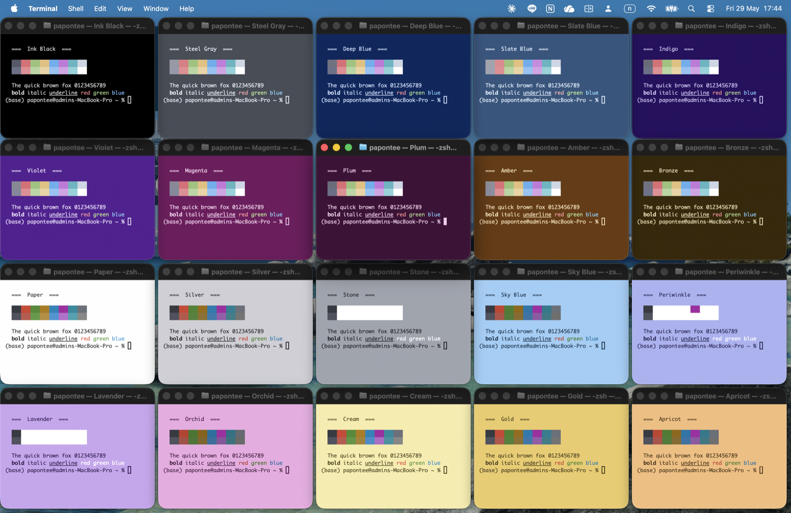

# macos-terminal-themes

**A pack of 20 easy-on-the-eyes themes for macOS Terminal.app that auto-follows
your system appearance — and gives every new window a different color so you can
tell your terminals apart at a glance.**



> All 20 themes at once (`tint demo`): 10 dark on top, 10 light on the bottom —
> every one clearly distinct.

- 🎨 **10 dark + 10 light themes**, each clearly distinct (no two look alike).
- 🌗 **Follows macOS Light/Dark in real time** — flip your appearance and every
  open window re-themes instantly, like a native app.
- 🎲 **Random theme per new window** (within the current appearance) so you never
  confuse "the window running the server" with "the window running tests."
- 😌 **Low eye strain by design**: readable text contrast on every theme, and
  **no harsh, no green, and no red backgrounds**.
- 🪶 **Light footprint**: an event-driven watcher that idles at ~0% CPU.

```
DARK   Ink Black · Steel Gray · Deep Blue · Slate Blue · Indigo
       Violet · Magenta · Plum · Amber · Bronze
LIGHT  Paper · Silver · Stone · Sky Blue · Periwinkle
       Lavender · Orchid · Cream · Gold · Apricot
```

---

## Requirements

- **macOS** with the built-in **Terminal.app**.
- That's it. If the **Swift toolchain** (`swiftc`, comes with Xcode Command Line
  Tools) is present, the appearance watcher is event-driven; otherwise it falls
  back to a lightweight 2-second poller. Either way, no other dependencies.

## Install

```sh
git clone https://github.com/aatuodcrd/macos-terminal-themes.git
cd macos-terminal-themes
./install.sh
```

Then open a new Terminal window (or run `source ~/.zshrc` in the current one).

The installer:
1. Imports the 20 `.terminal` color profiles into Terminal.
2. Sets up a login agent that watches macOS appearance changes.
3. Adds a small hook to `~/.zshrc` that randomizes each new window's theme.

> The import step briefly opens and closes a few helper windows. It only ever
> closes windows **it just opened** — see [Safety](#safety).

## Usage

| Action | What happens |
| --- | --- |
| Open a new window | Gets a random theme from the current-appearance pool |
| Switch macOS Light ⇄ Dark | Every open window re-themes instantly |
| `tint demo` | Opens all 20 themes tiled across the screen to compare |
| `tint dark` / `tint light` | Force the current window to a random dark/light theme |
| `tint all` | Re-randomize every open window now |
| `tint` | Re-randomize just the current window |
| `note "deploying prod"` | Pin a big, faint watermark at the top of **this** window |
| `note` | Clear the watermark |

### Window notes

`note "text"` marks what a window is for, so you can tell windows apart at a
glance. It's per-window/pane (each keeps its own) and also sets the tab title.
Clear with a bare `note`.

- **iTerm2** — uses the native [badge](https://iterm2.com/documentation-badges.html):
  real text on the **background layer**, behind your shell text, faint and big.
  This is the good path; resize the badge under *Settings → Profiles → General →
  Badge*.
- **Apple Terminal** — has no behind-the-text layer (no live background-image API,
  ignores DEC double-size), so it falls back to a big dim banner pinned in a
  reserved top region, redrawn each prompt. Big letters use
  [`figlet`](https://formulae.brew.sh/formula/figlet) (`brew install figlet`);
  without it you get a dim caps banner. `note` always resets it cleanly.

## Customize

Your theme pools live in `~/.config/terminal-theme/profiles.conf`:

```sh
DARK_THEMES=(
  "Ink Black"
  "Indigo"
  # remove ones you don't like, reorder, or add any installed profile by name
)
LIGHT_THEMES=(
  "Paper"
  "Cream"
)
```

Changes take effect on the next new window — no reload needed. You can mix in
your own Terminal profiles; just list their exact names.

### Re-generate / tweak the themes

The themes are produced by `tools/generate-themes.swift` (colors + automatic
contrast fixing live there). Edit the palette and run:

```sh
swift tools/generate-themes.swift   # rewrites themes/*.terminal
./install.sh                        # re-imports them
```

## How it works

```
~/.config/terminal-theme/
├── profiles.conf        # your dark/light theme pools
├── apply-theme.sh       # picks a random theme for the current appearance
├── theme-watch(.swift)  # event-driven macOS appearance watcher
├── demo.sh / demo-card.sh
└── …
```

- **Per-window randomization** — the `~/.zshrc` hook runs `apply-theme.sh` in the
  background on each new interactive Terminal shell. It seeds from
  `/dev/urandom` and avoids repeating the previous pick.
- **Real-time switching** — a LaunchAgent (`com.term-tint.theme-sync`) runs a
  watcher that subscribes to `AppleInterfaceThemeChangedNotification`. On change
  it re-themes every open window to the new appearance's pool.
- **Contrast** — each generated theme has its text and ANSI palette nudged
  (WCAG ≥ 4.5:1 for body text, ≥ 3:1 for accents) so nothing blends into the
  background.

## Safety

Importing `.terminal` files works by opening them in Terminal. term-tint only
closes windows whose IDs appear **after** its own pre-import snapshot, and if
that snapshot can't be read it closes nothing. The `demo` command only opens
windows and never closes any. Your own windows are never touched.

## Uninstall

```sh
./uninstall.sh
```

Stops the watcher, removes the `~/.zshrc` hook and installed files, and asks
whether to also delete the 20 color profiles from Terminal.

## License

MIT — see [LICENSE](LICENSE).
